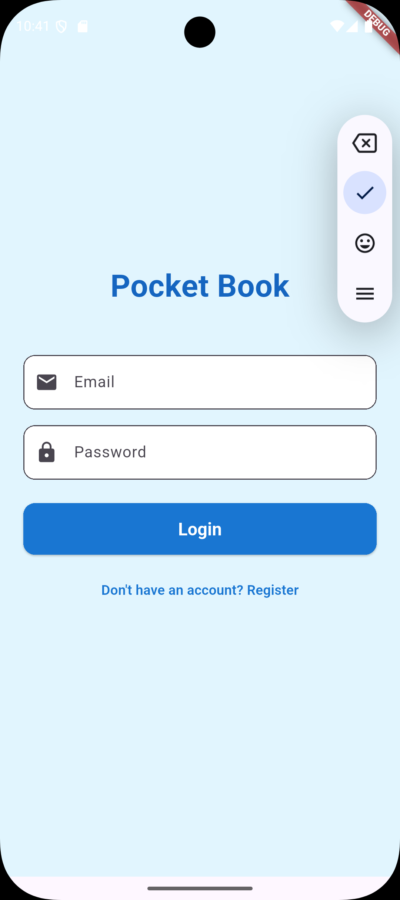
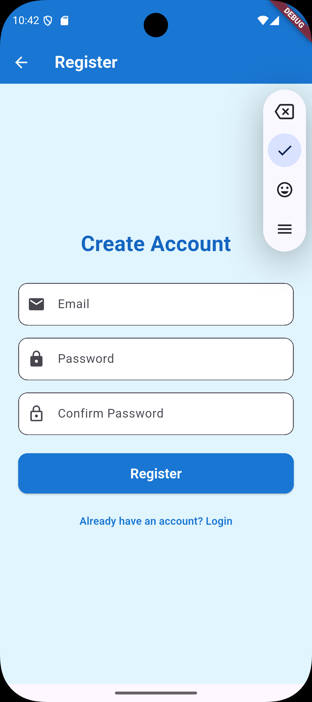
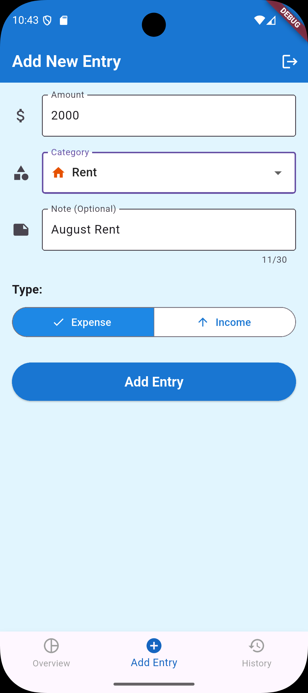
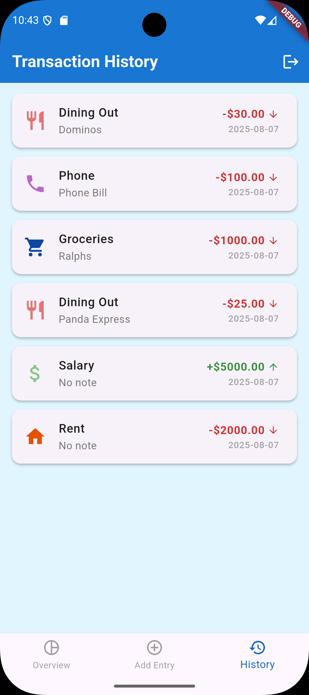
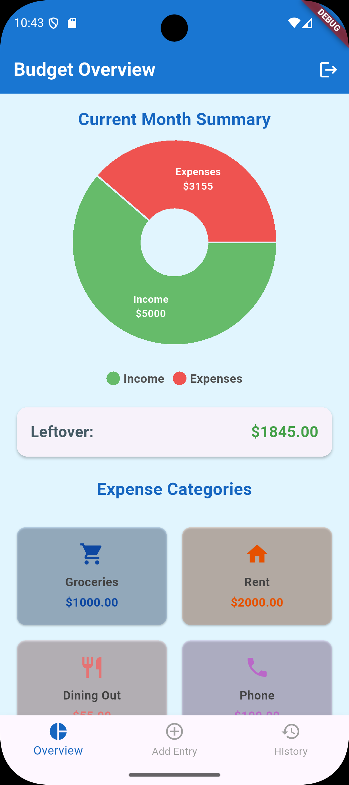

# Pocket Book - Personal Finance Tracker

Pocket Book is a Flutter-based mobile application designed to help users easily track their income and expenses. With a clean interface and Firebase integration, it offers a secure and personalized way to manage personal finances.

## Screenshots

_(Ideally, you would replace these placeholders with actual screenshots of your app)_

|                    Login Screen                     |                     Signup Screen                     |                      Add Transaction (Example)                      |                     History Screen                      |                      Overview Screen                      |
| :-------------------------------------------------: | :---------------------------------------------------: | :-----------------------------------------------------------------: | :-----------------------------------------------------: | :-------------------------------------------------------: |
|  |  |  |  |  |
|          _User login with email/password._          |               _New user registration._                |                       _Adding a new expense._                       |             _Viewing transaction history._              |        _Viewing overview of expenses by category_         |

## Features

- **User Authentication:** Secure email and password based login and registration.
- **Transaction Logging:** Easily add income or expense transactions with details like amount, category, date, and notes.
- **Categorization:** Assign categories to transactions (e.g., Salary, Groceries, Rent) with unique icons and colors for quick visual identification.
- **Transaction History:** View a chronological list of all transactions, sorted by date (newest first).
- **Clear Visuals:** Income and expenses are distinctly color-coded (green for income, red for expenses) and marked with up/down arrows.
- **Data Persistence:** All transaction data is securely stored and synced across devices using Firebase Realtime Database.
- **User-Specific Data:** Each user's transaction data is private and linked to their account.
- **Sign Out:** Securely log out of the application.

## Tech Stack

- **Flutter:** UI toolkit for building natively compiled applications for mobile, web, and desktop from a single codebase.
- **Dart:** Programming language used for Flutter development.
- **Firebase:** Backend platform for building web and mobile applications.
  - **Firebase Authentication:** For user management.
  - **Firebase Realtime Database:** For storing and syncing transaction data.

## Firebase Integration

Pocket Book leverages Firebase for its backend needs, providing a robust and scalable solution.

### Authentication

- Uses Firebase Email & Password authentication to manage user accounts.
- Ensures that each user's data is private and accessible only after successful login.

### Realtime Database

- User-specific transaction data is stored in the Firebase Realtime Database under a `users/{userID}/transactions` path.
- Each transaction includes fields such as:
  - `amount` (num)
  - `type` (String: "income" or "expense")
  - `category` (String)
  - `date` (String: ISO 8601 format)
  - `note` (String, optional)
- Realtime data syncing ensures that the transaction history is always up-to-date.
